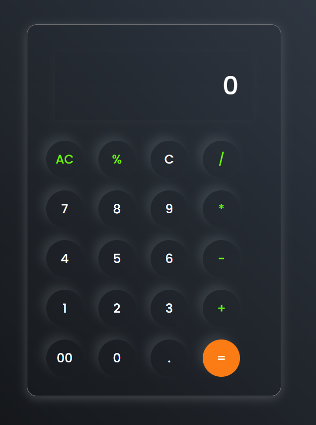

# Calculator App

A simple, responsive calculator built with **HTML, CSS, and JavaScript**.  
This project demonstrates DOM manipulation, event handling, and clean UI design using CSS. 

## Click below to see the website
[Calculator Website](https://aryanbhardwaj4224.github.io/-Calculator-/)

---

## 🚀 Features
- Basic arithmetic operations (`+`, `-`, `*`, `/`, `%`)
- Clear all (`AC`) and delete last entry (`C`)
- Decimal and double zero support
- Responsive and minimal UI
- Built without any external JS frameworks

---

## 📸 Preview

### Light/Dark UI


### Usage Example


---

## 📂 Tech Stack
- **HTML5** – structure  
- **CSS3** – styling and layout  
- **JavaScript (Vanilla)** – functionality  

---

## ⚙️ How to Run
1. Clone the repository:
   ```bash
   git clone https://github.com/your-username/your-repo-name.git
   
2. Navigate into the project directory:
 ```bash
   cd Calculator
```
3.Open `index.html` in your browser.

